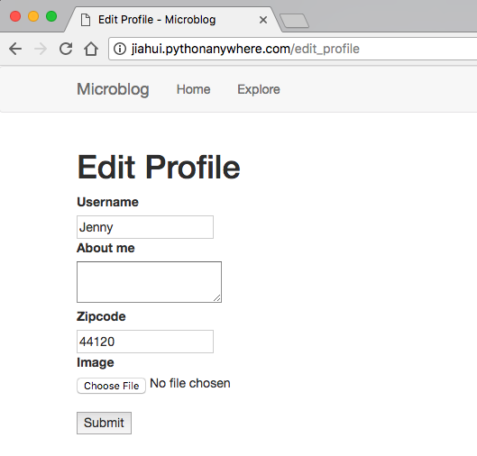
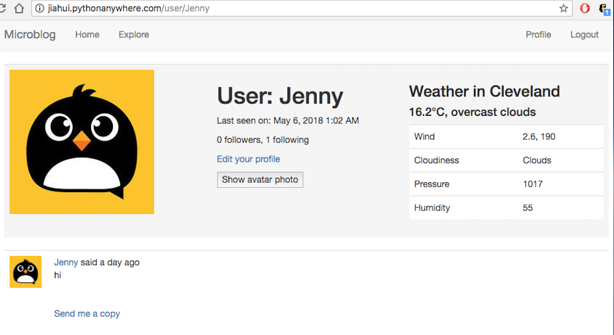
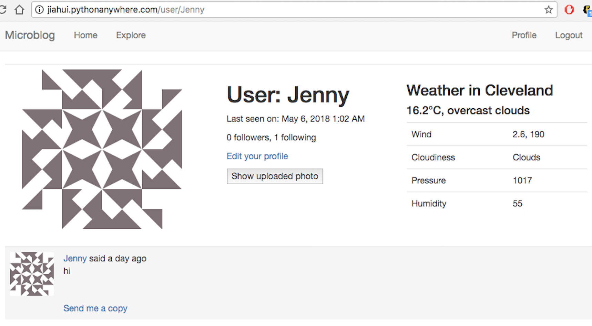
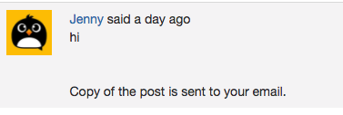
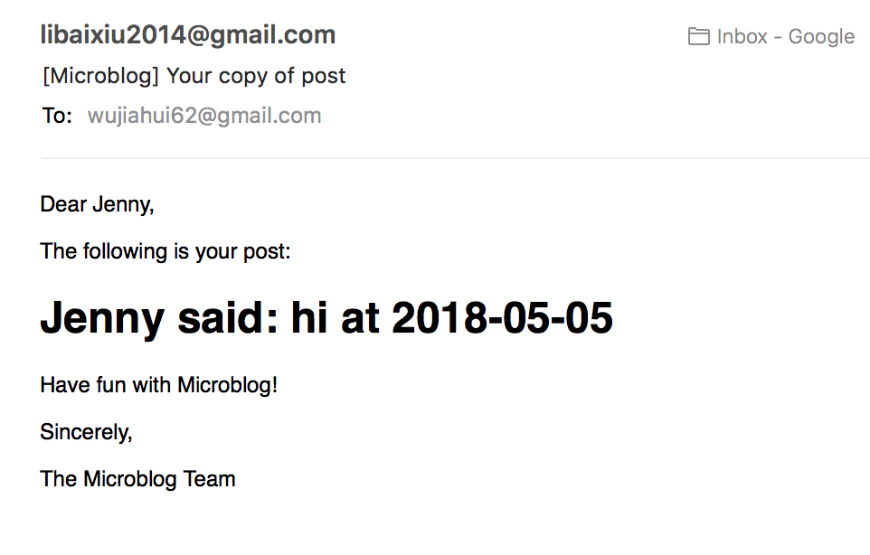

# Final project - Add 3 features to the microblog application

* ### Pythonanywhere url: http://jiahui.pythonanywhere.com

* ### DigitalOcean url: http://206.189.205.179

* ### Source code: https://github.com/wujiahui62/microblog

* ### Report: https://github.com/wujiahui62/microblog/blob/master/report/final_project.md

---
## Examples of the added features

* user can upload their photos and change zipcode in the `edit_profile` page



* after saving thoses changes and going back to the `user` page, the weather of the zipcode will show on the right of the profile, and uploaded image will be used as a photo.



* User can click the `show avatar photo` button or the photo to change back to avatar images, and can change back by clicking `Show uploaded photo` or the photo.



* Every post has a `Send me a copy` link, after click user will get the post content, author and post time by email.



* Email functionality works on my local computer, however, it does not work after deplying on PA



---

## Code 

* `config.py`, configure the weather api key and uploads

```
    WEATHERAPIKEY = '&appid=c63608b30062c60e04f04ba158de1c84'
    UPLOADS_DEFAULT_DEST = 'app/static/img/'
    UPLOADS_DEFAULT_URL = 'http://localhost:5000/static/img/'
    UPLOADED_IMAGES_DEST = 'app/static/img/'
    UPLOADED_IMAGES_URL = 'http://localhost:5000/static/img/'
```

* `app/__init__.py`, configure the image uploading via Flask-Uploads

```
from werkzeug.utils import secure_filename
from flask_uploads import UploadSet, IMAGES, configure_uploads

# Configure the image uploading via Flask-Uploads
images = UploadSet('images', IMAGES)
configure_uploads(app, images)

```

* `app/models.py`, change to models of table User, added more columns

```
class User(UserMixin, db.Model):
    zipcode = db.Column(db.Integer)
    image_filename = db.Column(db.String, default=None, nullable=True)
    image_url = db.Column(db.String, default=None, nullable=True)

```

* `app/routes.py`, added code to handle zipcode, weather api request, image_url and send copy functionality

```
import requests
import math

@app.route('/edit_profile', methods=['GET', 'POST'])
...
def edit_profile():
...
    if form.validate_on_submit():
        ...
        current_user.zipcode = form.zipcode.data
        filename = images.save(request.files['image'])
        current_user.image_filename = filename
        current_user.image_url = images.url(filename)
        ...
    elif request.method == 'GET':
        form.zipcode.data = current_user.zipcode
    return render_template('edit_profile.html', title=_('Edit Profile'),
                           form=form)

@app.route('/user/<username>')
def user(username):
    ...
    zipcode = user.zipcode
    if zipcode:
        api = 'http://api.openweathermap.org/data/2.5/weather?zip={},us{}'.format(zipcode, app.config['WEATHERAPIKEY'])
        r = requests.get(api)
        if r.status_code == 200:
            weather = r.json()
            temp = round(weather['main']['temp'] - 273.15, 1)
        else:
            return _('Error, the weather service failed.')
    else:
        weather = 'weather'
        temp = 'temp'
    ...
    return render_template('user.html', user=user, posts=posts.items, next_url=next_url, prev_url=prev_url, weather=weather, temp=temp)

@app.route('/send_copy', methods=['POST'])
@login_required
def send_copy():
    user = current_user
    post = request.form['post_text']
    author = request.form['post_author']
    time = request.form['post_time']
    send_copy_email(user, post, author, time)
    return "send email"

```

* `app/email.py`, define a send_copy_email function and use it in the route /send_copy, added `send_copy.text` and `send_copy.html` in `app/templates/email`

```
def send_copy_email(user, post, author, time):
    send_email(_('[Microblog] Your copy of post'),
               sender=app.config['ADMINS'][0],
               recipients=[user.email],
               text_body=render_template('email/send_copy.txt',
                                         user=user, post=post, author=author, time=time),
               html_body=render_template('email/send_copy.html',
                                         user=user, post=post, author=author, time=time))
```


* `app/forms.py`, added zipcode and image in the form

```
from flask_wtf.file import FileField, FileAllowed, FileRequired
from app import images

class EditProfileForm(FlaskForm):
    zipcode = IntegerField(_l('Zipcode'))
    image = FileField('Image', validators=[FileRequired(), FileAllowed(images, 'Images only!')])

```

* `app/templates/_formhelper.html`

```

  <dt>{{ field.label }}
  <dd>{{ field(**kwargs)|safe }}
  
    <ul class=errors>
    
      <li>{{ error }}</li>
    
    </ul>
  
  </dd>


```

* `app/templates/edit_profile.html`, modified the html for file uploding

```





    <h1>{{ _('Edit Profile') }}</h1>
    <div class="row">
        <div class="col-md-4">
            <form action="{{ url_for('edit_profile') }}" method="post" enctype="multipart/form-data">
                {{ form.csrf_token }}
                <dl>
                  {{ render_field(form.username) }}
                  {{ render_field(form.about_me) }}
                  {{ render_field(form.zipcode) }}
                  {{ render_field(form.image) }}
                </dl>
                <p><input type=submit value=Submit>
                </form>
    </div>

```

* `app/templates/_post.html`, in the place where shows post.author.avatar only, added condition

```

<div class="photo"></div>
<div class="avatar"></div>

<div></div>

```

* `app/templates/user.html`, same here

```

<td><div width="256px" class="photo"></div>
<td><div width="256px" class="avatar"></div>
</td>           

<td width="256px">
</td>            


```

* `app/templates/base.html`added send_copy function to receive the info from `_post.html` and call `/send_copy` route, another function is to toggle the change of photos

```
<script>

    function send_copy(sourceElem, destElem, sourceAuthor) {
        $(destElem).html('');
        
        $.post('/send_copy', {
            post_text: $(sourceElem).text(),
            post_author: $(sourceAuthor).text(),
            post_time: $(sourceAuthor).attr('data-time')
        }).done(function(response) {
            $(destElem).text("{{ _('Copy of the post is sent to your email.') }}")
        }).fail(function() {
            $(destElem).text("{{ _('Error: Could not contact server.') }}");
        });
    }

    $('.avatar').hide();
    $('.photo,.avatar').on('click',function(){

        $('.photo,.avatar').toggle()
    });

    $('.avatar').hide();
    $('.photo,.avatar').on('click',function(){

        $('.photo,.avatar').toggle()
    });
</script>
```

* `app/templates/_post.html`, added span to `post.author.username` to get the authorname and time, added span at the end to show `Send me a copy`

```
    <span data-time={{post.timestamp}} id="author{{ post.id }}">
                        {{ post.author.username }}

    <span id="send_copy{{ post.id }}">
            <a href="javascript:send_copy(
                '#post{{ post.id }}',
                '#send_copy{{ post.id }}',
                '#author{{ post.id }}'
            );">{{ _('Send me a copy') }}</a>
        </span>

```

---

## Deployment on Pythonanywhere

* go to the bash console of PA

```
cd mysite
git clone https://github.com/wujiahui62/microblog.git
cd microblog
mkvirtualenv --python=/usr/bin/python3.6 my-virtualenv
pip install flask
pip install -r requirements.txt
```

* configure the `wsgi` file

```
import sys
path = '/home/Jiahui/mysite/microblog'
if path not in sys.path:
    sys.path.append(path)

from microblog import app as application  # noqa

```

* configure the webapp

```
source code: /home/Jiahui/mysite/microblog
working directory: /home/Jiahui/mysite/microblog
Virtualenv: /home/Jiahui/.virtualenvs/my-virtualenv
```

* disable the following line in start.sh

```
source venv/bin/activate
flask run
```

* change mode of the start.sh file and run start.sh

```
chmod +x /home/Jiahui/mysite/microblog/start.sh
./start.sh
```

* Reload, done

---
## Deployment on DigitalOcean

* create a droplet with Ubuntu image

* use ssh connection and change the password

```
ssh root@206.189.205.179
```

* run the following command to install python and pip

```
apt-get update
apt-get -y upgrade
apt-get install -y python3-pip
pip3 install --upgrade pip
```

* Clone the code and install the packages

```
git clone https://github.com/wujiahui62/microblog.git
cd microblog
chmod +x install.sh
./install.sh
```

* change the firewall setting and run the app, ctrl+A+D to detach the screen, fg to bring it to foreground

```
screen
ufw status
ufw allow http
./start.sh
flask run --host=0.0.0.0 &
```

---
## Reference

* The app is developed based on the code provided by Dr. Delozier, [click here](https://github.com/drdelozier/cloud-application-design/tree/master/code/microblog).
* [combine flask-wtf and flask-uploads](http://www.patricksoftwareblog.com/tag/flask-uploads/)
* [deploy on pythonanywhere](https://scotch.io/tutorials/build-a-crud-web-app-with-python-and-flask-part-three)
